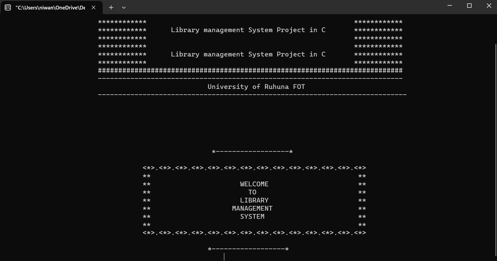
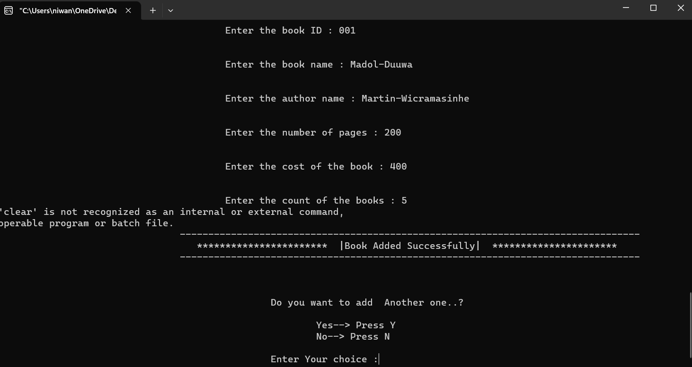
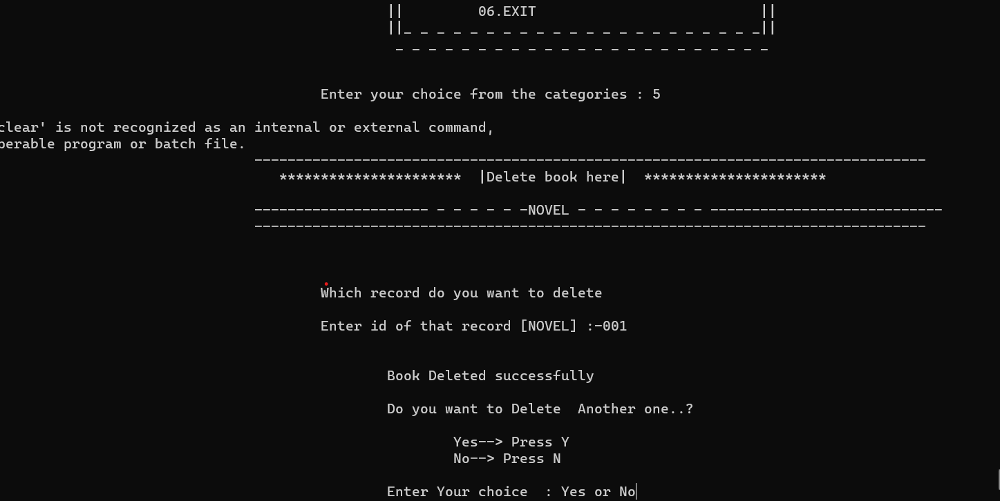
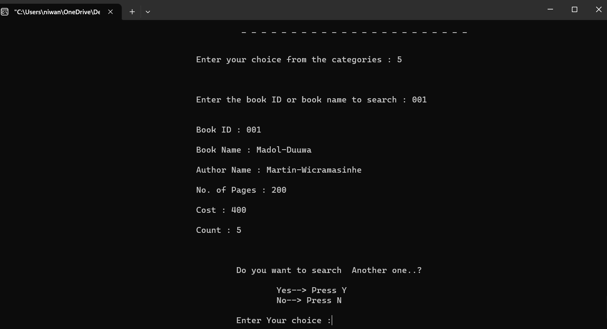
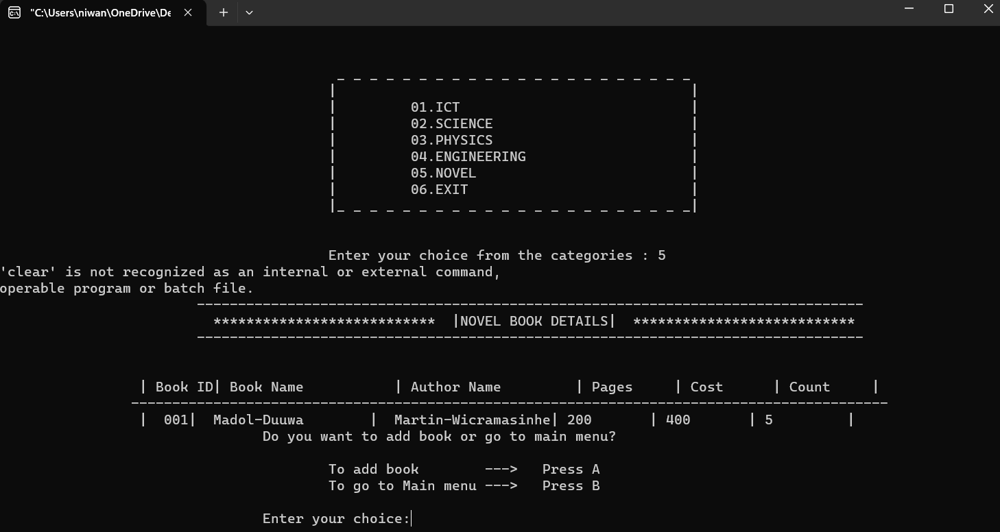

# Library Management System in C
---
## Overview
- This repository contains a comprehensive Library Management System (LMS) implemented in C. The system allows users to manage books and patrons, facilitating various operations such as adding, deleting, searching, and borrowing books. The project is designed to be a simple yet effective tool for managing library resources efficiently.

## Features

- **Add Books**: Easily add new books to the library's collection.

- **Delete Books**: Remove books that are no longer available.

- **Search Books**: Search for books by title, author, or ISBN.

- **Display Records**: View lists of all books and patrons, including borrowed books and due dates.
  

